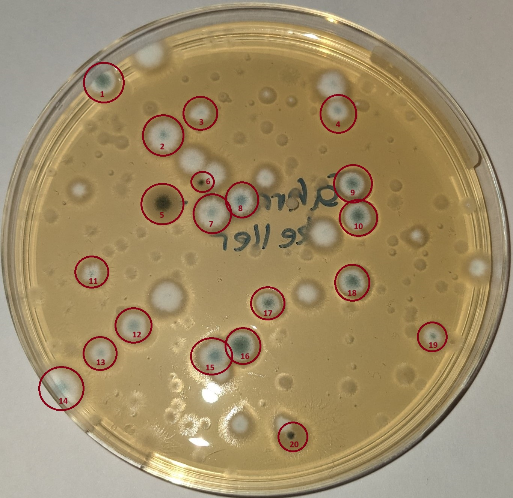
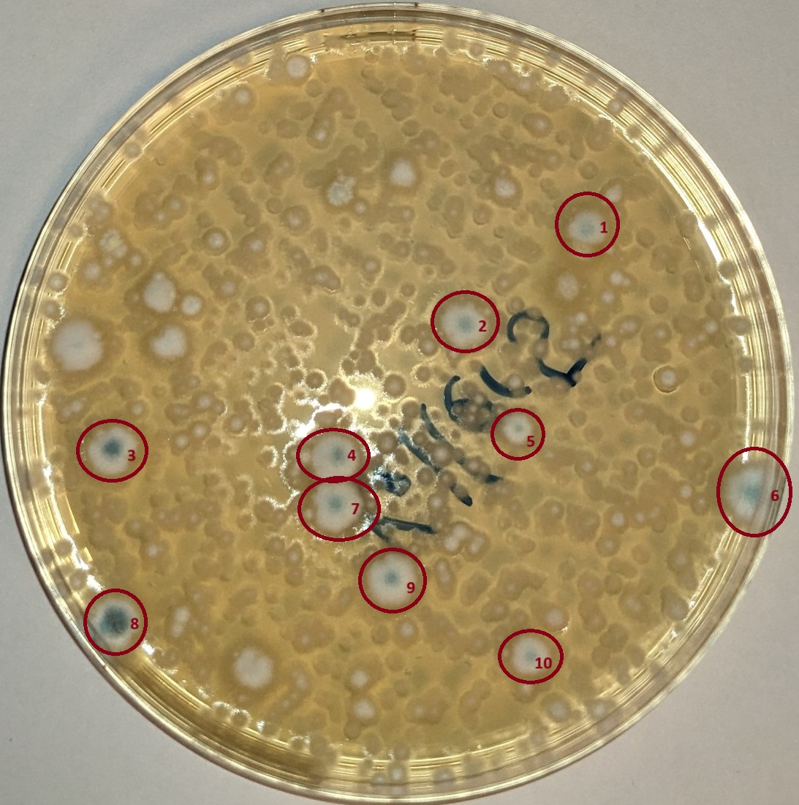
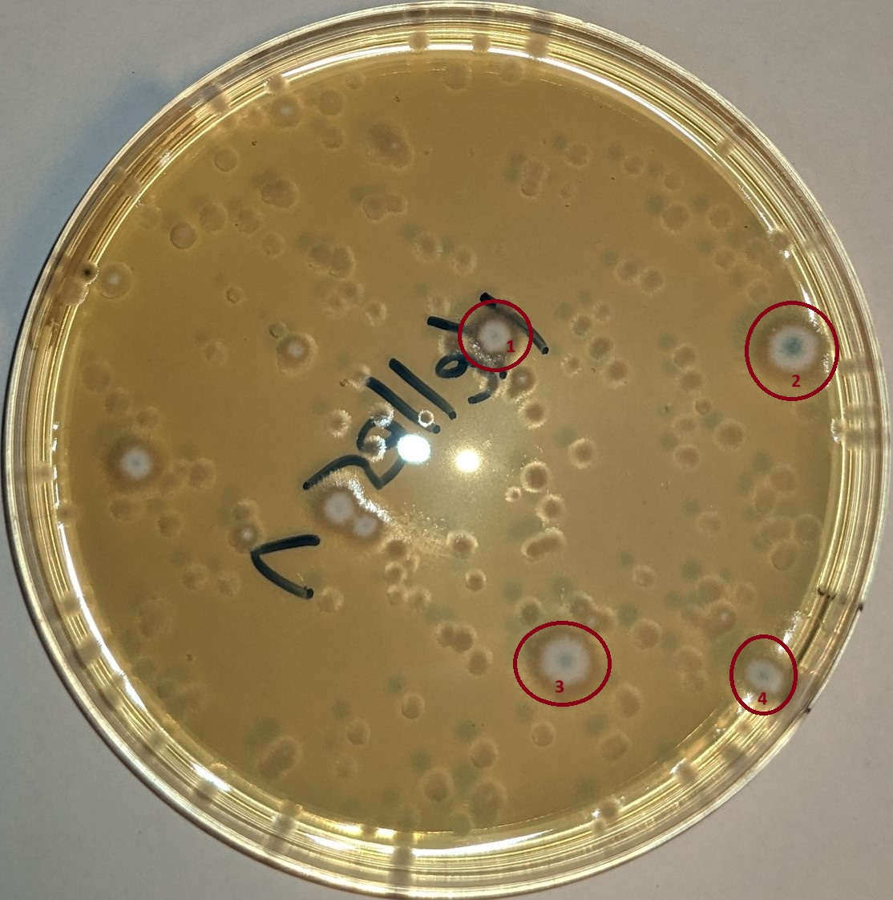
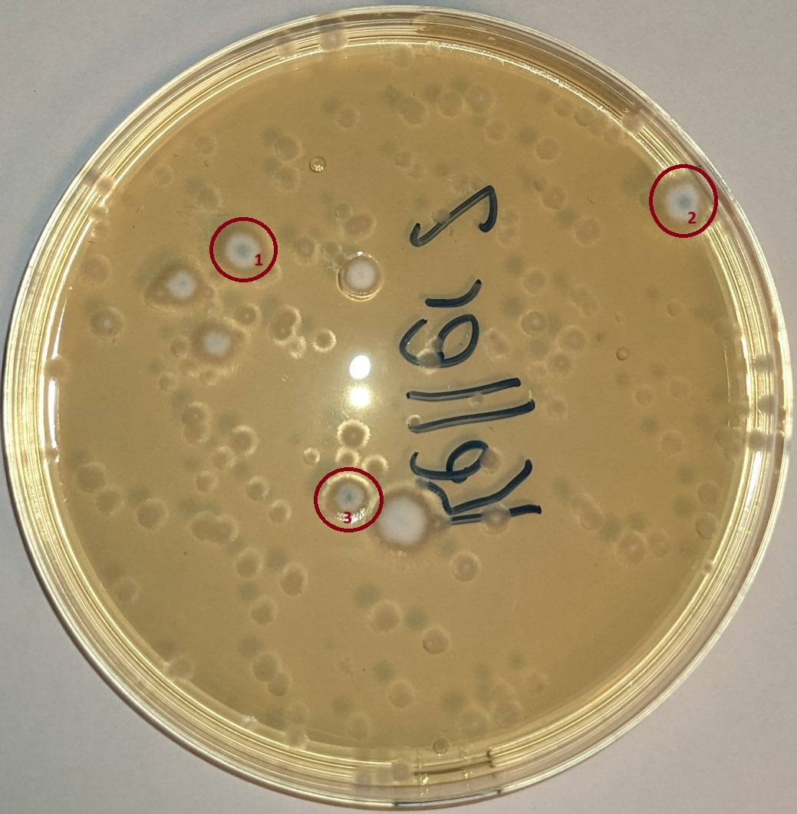
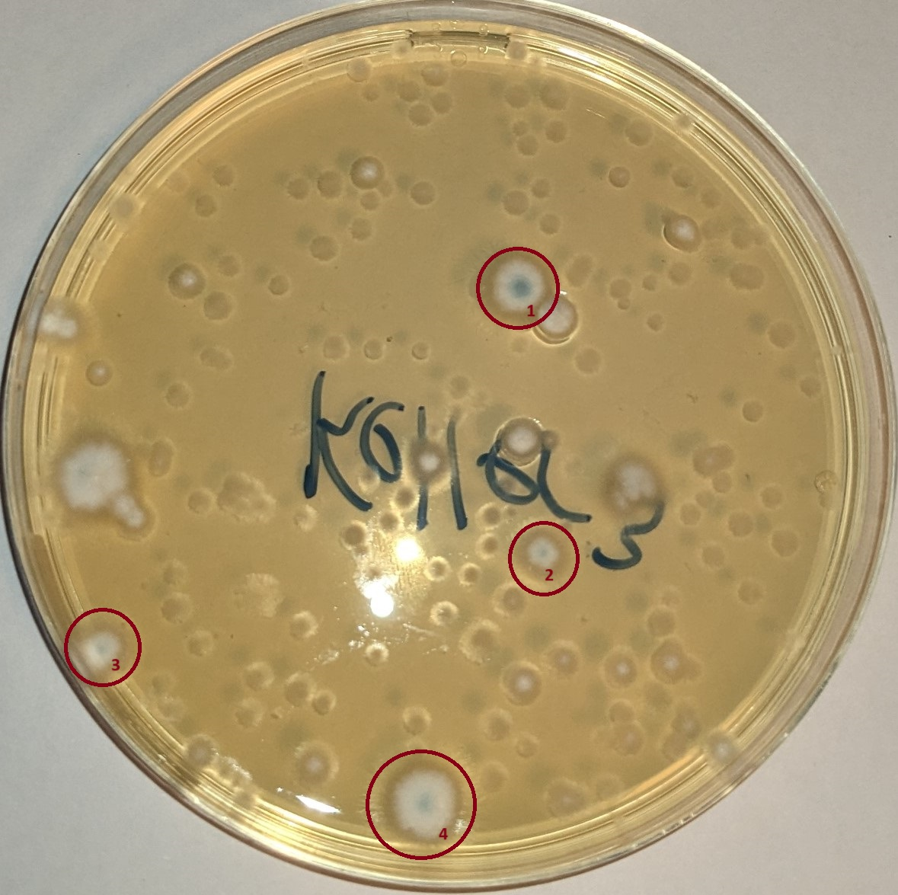
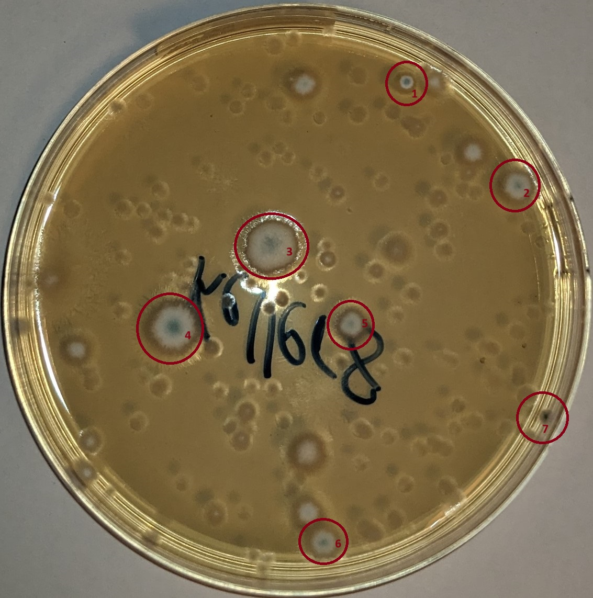

| Keller | nach 3 Tagen (Bild) | nach 3 Tagen (Bewertung) | nach 6 Tagen (Bild) | nach 6 Tagen (Bewertung) | nach 10 Tagen (Bild) | nach 10 Tagen (Bewertung) |
|---|---|---|---|---|---|---|
| **Fahrradkeller** |  | 20 (leicht erhöhte Belastung) |  | 5 | | 5 |
| **Technikraum** |  | 5 (geringe Belastung) |   |   |   |   |
| **Keller 5** |  | 10 (durchschnittliche Belastung) |   |   |   |   |
| **Keller 1** |  | 4 (geringe Belastung) |   |   |   |   |
| **Keller 2** |  | 3 (geringe Belastung) |   |   |   |   |
| **Keller 3** |  | 4 (geringe Belastung) |   |   |   |   |
| **Keller 4** |  | 2 (geringe Belastung) |   |   |   |   |
| **Keller 8** |  | 7 (durchschnittliche Belastung) |   |   |   |   |
| **Keller 9** |  | 9 (durchschnittliche Belastung) |   |   |   |   |
| **Keller 6** |  | 1 (geringe Belastung) |   |   |   |   |