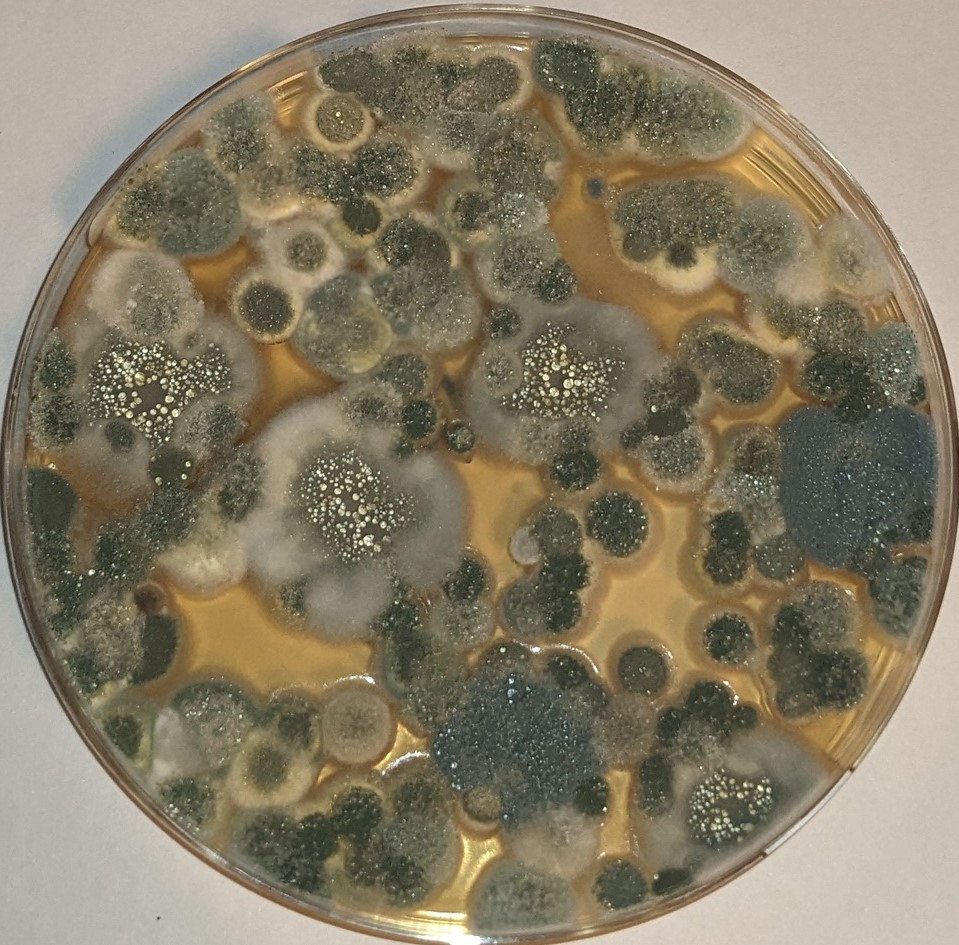
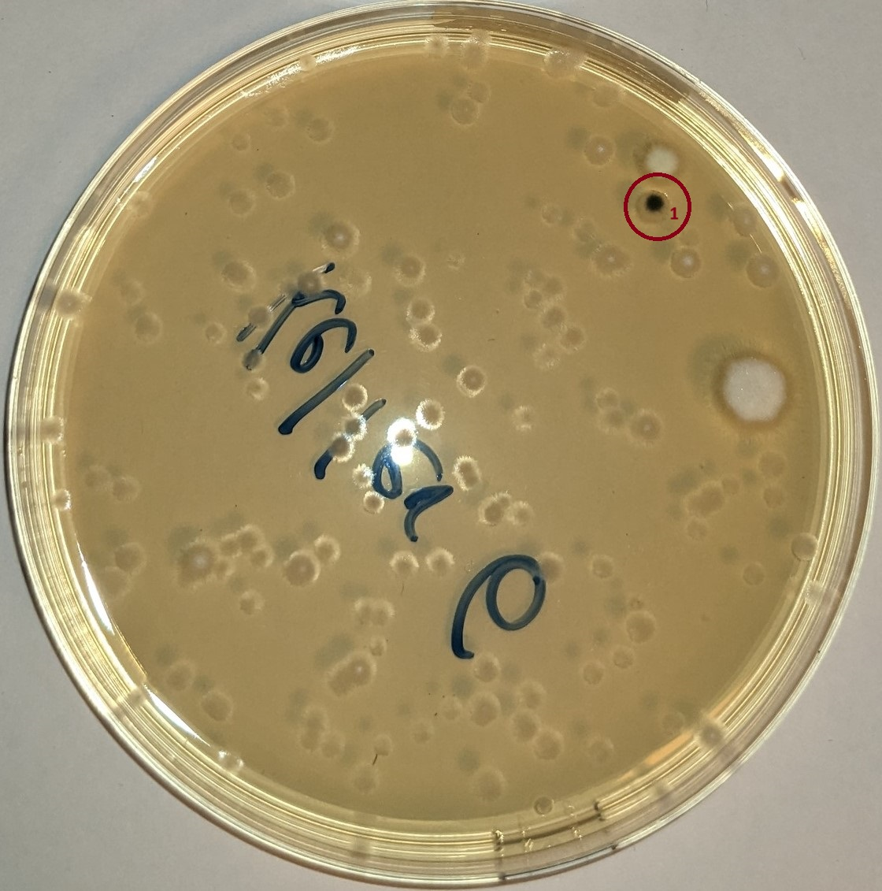
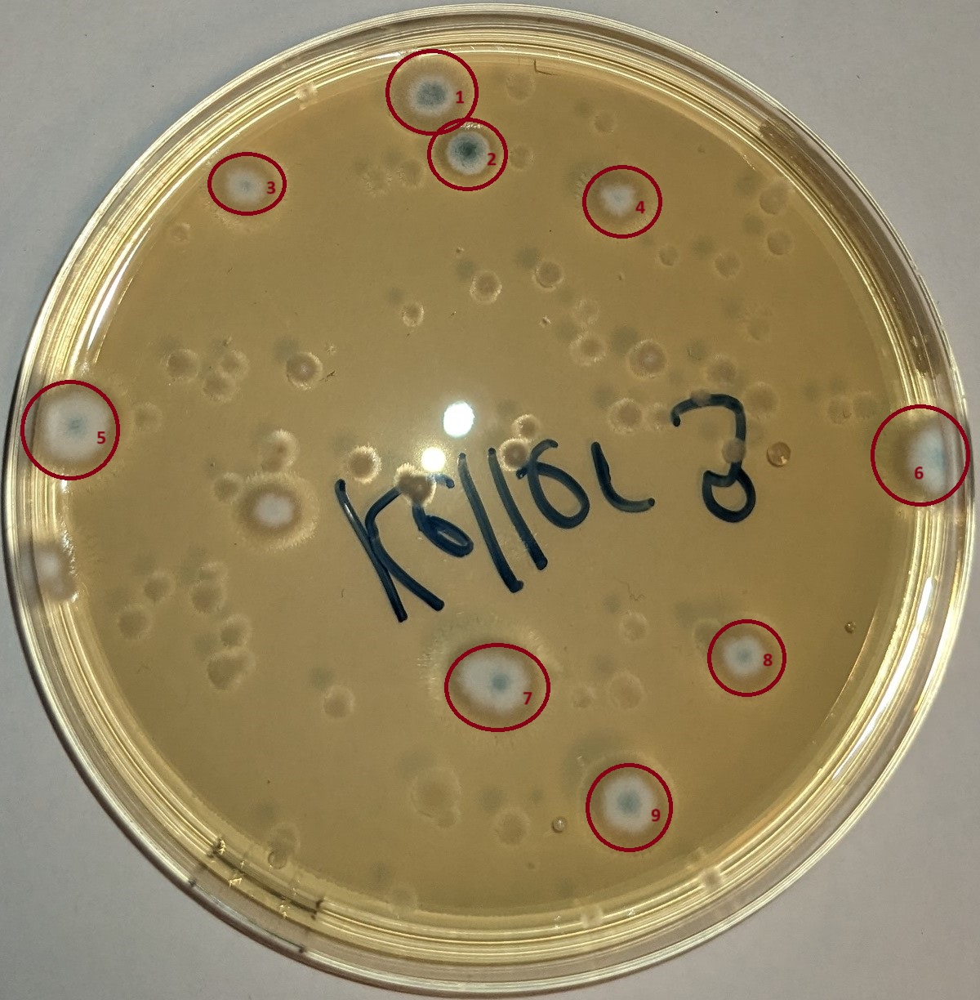

# Schimmeltest 29.03.2024

Hier ist die [Anleitung für die Auswertung](https://www.airself.de/images/pdf/airself-schimmeltest-ebook.pdf) zum Nachlesen.  

An diesen Orden haben wir die Schimmeltests aufgestellt:

| Keller | nach 3 Tagen (Bild) | nach 3 Tagen (Anzahl) | nach 6 Tagen (Bild) | nach 6 Tagen (Anzahl) | nach 11 Tagen (Bild) | nach 11 Tagen (Anzahl) | Bewertung |
|---|---|---|---|---|---|---|---|
| **Fahrradkeller** |  | 20 |  | > 52 | | > 52 | sehr hohe Belastung |
| **Technikraum** |  | 5 |  | 20 |  | ca. 20 | leicht erhöhte Belastung |
| **Keller 1** |  | 4 |  | > 52 |  | > 52 | sehr hohe Belastung |
| **Keller 2** |  | 3 |  | > 52 |  | > 52 | sehr hohe Belastung |
| **Keller 3** |  | 4 |  | > 52 |  | > 52 | sehr hohe Belastung |
| **Keller 4** |  | 2 |  | 19 |  | 19 | leicht erhöhte Belastung |
| **Keller 5** |  | 10 |  | > 100 |  | > 100 | sehr hohe Belastung |
| **Keller 6** |  | 1 |  | > 52 |  | > 52 | sehr hohe Belastung |
| **Keller 8** |  | 7 |  | > 52 |  | > 52 | sehr hohe Belastung |
| **Keller 9** |  | 9 |  | > 52 |  | > 52 | sehr hohe Belastung |
